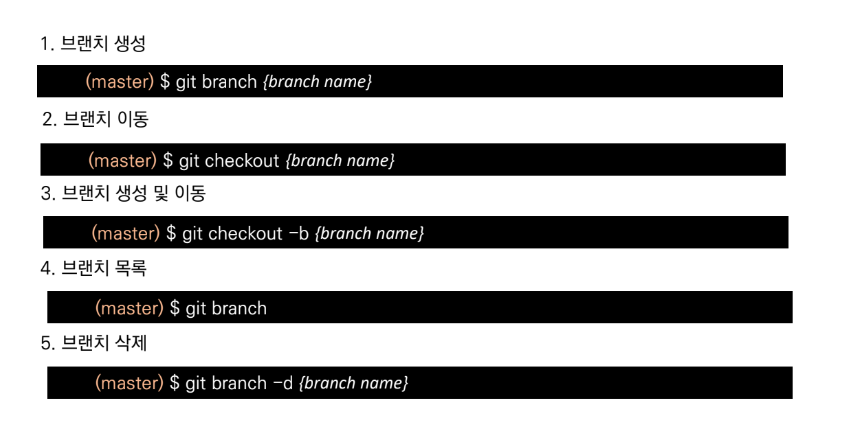

# Git 문법 정리

## 개요

- Git은 분산버전관리시스템으로 코드의 버전을 관리하는 도구
- 2005년 리눅스 커널을 위한 도구로 리누스 토르발스가 개발
- 컴퓨터 파일의 변경사항을 추적하고 여러 명의 사용자들 간에 파일들의 작업을 조율

## 분산버전관리시스템

- 중앙집중식버전관리시스템
- 로컬에서는 파일을 편집하고 서버에 반영
- 중앙 서버에서만 버전을 관리

- 분산버전관리시스템
- 로컬에서도 버전을 기록하고 관리
- 원격 저장소를 활용하여 협업

## 명령어

- git init : git 폴더가 생성되며 git bash에서는 (master)라는 표기를 확인할수 있음

- git add < file >: working directory상의 변경 내용을 staging area에 추가하기 위해 사용
- untracked 상태의 파일을 staged로 변경
- modified 상태의 파일을 staged로 변경

- git commit -m '< 커밋메시지>': staged 상태의 파일들을 커밋을 통해 버전으로 기록
- 커밋 메시지는 변경사항을 나타낼수 있도록 명확하게 작성해야함

- git log: 현재 저장소에 기록된 커밋을 조회

- git status: 파일의 상태를 알수 있음

- git push : 로컬 저장소의 버전을 원격저장소로 보낸다.

- git pull :원격저장소의 버전을 로컬 저장소로 가져온다

- git clone :원격 저장소를 복제하여 가져옴

- git remote -v :원격저장소 정보 확인

## Git 버전 관리 

- Git은 파일을 modified, staged,committed로 관리
- modified:파일이 수정된 상태(add 명령어를 통하여 staging area로)
- staged:수저한 파일을 곧 커밋할 것이라고 표시한 상태(commit 명령어로 저장소)
-committed:커밋이 된 상태

## push conflict
  
-  Push 실패: 로컬과 원격 저장소의 커밋 이력이 다른 경우 발생한다

1. 원격저장소의 커밋을 원격저장소로 가져와서(pull)
2. 로컬에서 두 커밋을 병합(다른 브런치를 만들어 작업한것을 병합)
3. 다시 GitHub로 push

## gitignore

- 일반적인 개발 프로젝트에서 버전 관리를 별도로 하지 않는 파일/디렉토리가 발생한다
- git 저장소에 .gitignore 파일을 생성하고 해당 내용을 관리한다.
- 이미 커밋된 파일은 반드시 삭제를 하여야 .gitignore로 적용이 됩니다

# branch
- 독립적으로 작업흐름을 만들고 관리할수 있음

 

 # merge
- 각 branch에서 작업을 한 이후 이력을 합치기위해 사용 