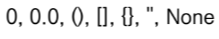
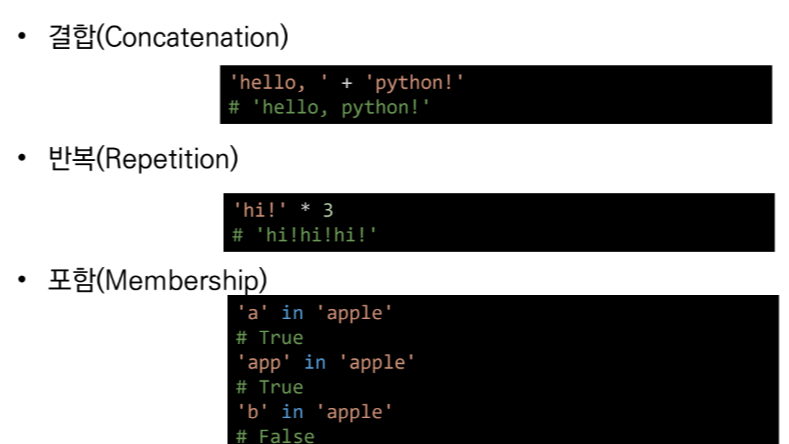
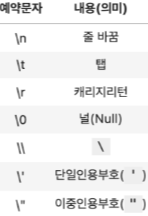

# 오늘 배운것

## 객체
- 파이썬에 담는 물건(사물)

## 변수
- 파이썬 안네 담겨 있는것

## 컴퓨터 
- 조작(계산)하고 저장하는 것

## Type

### 정수
- int
- 정수가 아닌 모든 실수는 float 타입
- 실수부 와 허수부로 구성된 복소수는 모두 complex 타입

### boolean 
- True,Flase 값을 가진 타입
- 다음은 모두 False로 변환

## 연산자

- 예시) x=10 : 오른쪽값을 왼쪽에 할당한다.

- and:모두 참인 경우 참, 그렇지 않으면 거짓
- or:둘중 하나만 참이라도 참, 그렇지 않으면 거짓

### 컨테이너:여러 개의 값을 담을 수 있는것
- 시퀀스
1. 문자열
2. 리스트
3. 레인지

#### 시퀀스형 컨테이너

#### 문자열
- 모든 문자는 str타입
- 문자열은 (')나(")를 활용하여 표기
- 기타

#### 리스트:변경 가능한 값들의 나열된 자료형
- 항상 대괄호 형태로 정의
- 대괄호 혹은 list()를 통해 생성
- 값 추가는 .append()
- 값 삭제는 .pop()

### none
- 파이썬 자료형 중 하나
- 파이썬에서는 값이 없음을 표현

### 코드작성 주의 사항
- 대소문자 구분
- 띄어쓰기
- 들여쓰기
 -들여쓰기 할때는 4칸(space)

### 주석
- 앞에'#'을 입력
- 주석을 인식하지 않음 사용자만을 위한 것

### 입출력
- input
 - 사용자로부터 값을 입력 받을 수 있는 내장함수

- print()
 - 결과물을 출력하기 위하여 활용